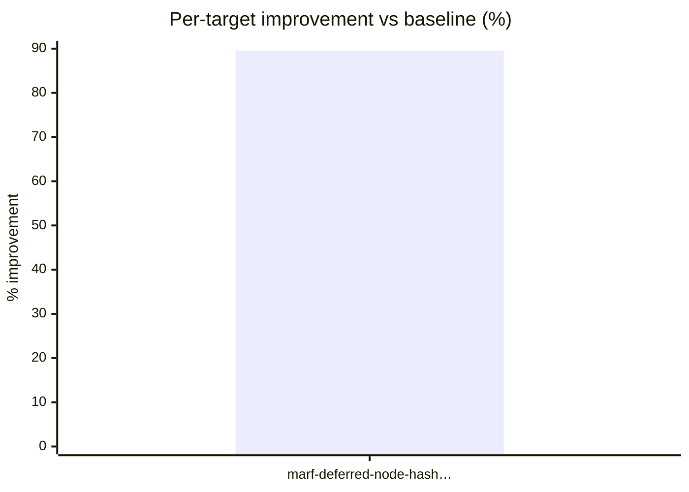

# Session 20260518-190321-nextest-flags-smoke

- Baseline run id: 1
- Baseline rerun id: 1
- Noise floor: 1%
- Target catalog: [targets.md](targets.md)

## Improvement vs baseline

## TL;DR

Out of **1** merged optimization target(s), 1 normal-PR target(s) measurably improved (avg +89.51%).

## What was found

Triage promoted **4** family(ies) to per-family analysis. Their dispositions:

| Family | Lens | Disposition |
| ------ | ---- | ----------- |
| [clarity-commit-trie-blob-append](../analysis/clarity-commit-trie-blob-append/analysis.json) | Commit time | not_actionable — The commit-time signal is real, but the dominant code in `TrieFile::append_trie_blob` is the required external-blob durability barrier: after determining the append offset it writes the serialized tr… |
| [finalize-trie-node-hashing](../analysis/finalize-trie-node-hashing/analysis.json) | Commit time | → contributed to **[marf-deferred-node-hash-direct-digest](#marf-deferred-node-hash-direct-digest)** (1 target(s) proposed) |
| [finalize-trie-node-hashing-alt](../analysis/finalize-trie-node-hashing-alt/analysis.json) | Commit time | → analyzer proposed 1 target(s) but none merged — see [rejected-by-merge](targets.md#rejected-by-merge) |
| [gl-api-oracle-price-runtime](../analysis/gl-api-oracle-price-runtime/analysis.json) | Tenure throughput | not_actionable — The promoted runtime-axis signal is real, and runtime is the nearest Clarity budget axis for these blocks, though the sampled blocks are not cap-saturating: the largest gl-api block uses about 1.54B … |

## What was chosen — and how it went

Each merged optimization target below carries the hotspot evidence the analyzer identified, the proposed change, and what the optimizer actually shipped. Excerpts are short — follow the links to the full writeups.

### 🔧 ✅ marf-deferred-node-hash-direct-digest — Normal PR · **Accepted** (+89.51%)

`calculate_node_hashes` at `stackslib/src/chainstate/stacks/index/storage.rs:818` · self_wall 20.65 s · 677k calls · risk: Medium · 1 contributor(s)

**Evidence.** Commit-time lens is real and directly actionable. In the full run, `calculate_node_hashes` appears in 100.0% of blocks, with 677,524 calls, 58,811.4 ms inclusive wall, and 20,653.91 ms self wall; top3 share is only 1.2%, so this is not an outlier artifact. The commit anchors total about 298.5 s across the run (`Segment: Finalize (merkle+seal)` 122,997.08 ms…

**Proposed.** Add a specialized deferred-seal hashing path inside `TrieRAM::calculate_node_hashes` that feeds the `Sha512_256` digest directly with `Digest::update()` instead of routing fixed byte slices through the generic `std::io::Write` consensus-serialization path. Keep the exact consens…

**Outcome.** _Coordinator-rendered companion view of `optimizer-report.json`. The JSON is authoritative; this file regenerates from it on every commit/demote pass._

Contributors: [finalize-trie-node-hashing](../analysis/finalize-trie-node-hashing/analysis.json)

Details: [experiment dir](../optimize/marf-deferred-node-hash-direct-digest/) · [target catalog](targets.md#marf-deferred-node-hash-direct-digest) · [implementation.md](../optimize/marf-deferred-node-hash-direct-digest/implementation.md)

---

## Outcomes

| Delivery mode    | Counts                                       |
| ---------------- | -------------------------------------------- |
| Normal PR        | Accepted 1 · Rejected 0 · Aborted 0 |
| Consensus PoC PR | PoC landed 0 · Aborted 0 |
| Consensus issue  | Routed to issue 0 · Aborted 0 |

## Coverage matrix (bucket × selection lens)

|                  | Tx latency | Tenure throughput | Commit time |
| ---------------- | ---------- | ----------------- | ----------- |
| Block processing | - | - | - |
| Block commit | - | - | 1 |

> Cell counts use each merged target's primary lens (the first contributor's selection lens). Targets with cross-lens convergence are counted once; see the `contributor_differences` field of `optimization-targets.json` for cross-lens cases.

## At a glance

| Target | Delivery mode | Status | Improvement | Run ids | Notes |
| ------ | ------------- | ------ | ----------- | ------- | ----- |
| [marf-deferred-node-hash-direct-digest](../optimize/marf-deferred-node-hash-direct-digest/) | Normal PR | [Accepted](../optimize/marf-deferred-node-hash-direct-digest/implementation.md) | 89.51% | [5](../optimize/marf-deferred-node-hash-direct-digest/run-1/bench-run.json) |  |

## Real hotspots without an actionable fix

The analyzer drilled into the families below, confirmed the signal at code
level, and could not find a structural handle. The reasons reflect code-level
constraints (consensus rules, inherent CPU cost, already-cached paths). These
are first-class artifacts — surface them to whoever decides what to optimize
next.

| Family | Lens | Reason |
| ------ | ---- | ------ |
| [clarity-commit-trie-blob-append](../analysis/clarity-commit-trie-blob-append/analysis.json) | Commit time | The commit-time signal is real, but the dominant code in `TrieFile::append_trie_blob` is the required external-blob durability barrier: after determining the append offset it writes the serialized trie blob, flushes the file handle, and calls `fd.sync_data()` before `trie_sql::write_external_trie_blob` records the offset/length in SQLite and before the enclosing MARF transaction commits. Removing or deferring that sync would allow a crash to leave durable SQLite metadata pointing at an un-durable or missing `.blobs` range. A meaningful fix would require a MARF external-blob storage/durability redesign or wider transaction protocol, not a localized code optimization to the current append path. |
| [gl-api-oracle-price-runtime](../analysis/gl-api-oracle-price-runtime/analysis.json) | Tenure throughput | The promoted runtime-axis signal is real, and runtime is the nearest Clarity budget axis for these blocks, though the sampled blocks are not cap-saturating: the largest gl-api block uses about 1.54B runtime of a 5B Epoch33 budget while read/write axes are much farther from their caps. The code-level cause is Epoch33 Clarity value lookup/clone charging: tuple_get evaluates the tuple expression then calls ValueRef::clone_with_cost before extracting a field, and clone_with_cost charges LookupVariableSize for large fold accumulator values. All 48 gl-api open/close calls in the run are at burn heights 925436-925508 in Epoch33, while the repo already gates pre-sanitized borrowed variable lookup to Epoch34 through StacksEpochId::uses_pre_sanitized_variables and Clarity VM ValueRef handling. Changing Epoch33 costs or clone semantics for these representatives would alter historical consensus; a non-consensus Rust optimization would not move the tenure-throughput lens. |

## Next steps

1 PR(s) + 0 PoC PR(s) + 0 issue(s) of 1 target(s); review and re-run rejected/aborted with refined analyses
