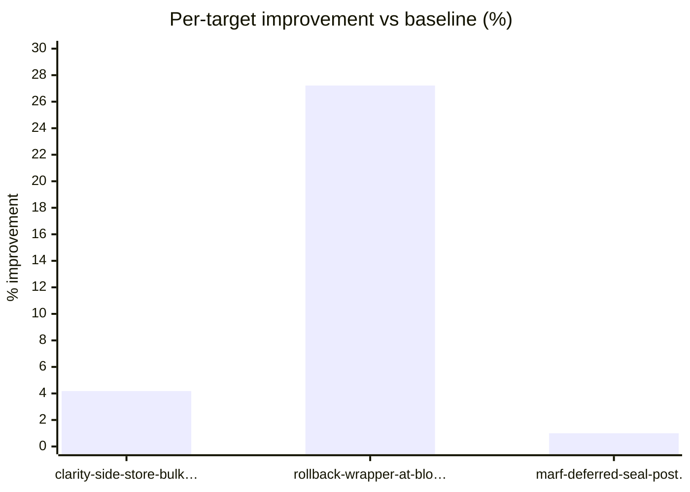

# Session 20260611-172955

- Baseline run id: 6
- Baseline rerun id: 6
- Noise floor: 1%
- Target catalog: [targets.md](targets.md)

## Improvement vs baseline

## TL;DR

Out of **3** merged optimization target(s), 3 normal-PR target(s) measurably improved (avg +10.80% (range 1.0%..27.2%)).

## What was found

Triage promoted **3** family(ies) to per-family analysis. Their dispositions:

| Family | Lens | Disposition |
| ------ | ---- | ----------- |
| [dlmm-add-liquidity-multi-throughput](../analysis/dlmm-add-liquidity-multi-throughput/analysis.json) | Tenure throughput | not_actionable — The throughput signal is real: add-liquidity-multi accounts for 29.86% of run runtime, 35.68% read_count, 37.92% read_length, 45.44% write_count, and 44.09% write_length, with write_count the promote… |
| [dual-stacking-snapshot-balance-fanout](../analysis/dual-stacking-snapshot-balance-fanout/analysis.json) | Tx latency | → contributed to **[rollback-wrapper-at-block-read-cache](#rollback-wrapper-at-block-read-cache)** (1 target(s) proposed) |
| [marf-trie-seal-hash-recalculation](../analysis/marf-trie-seal-hash-recalculation/analysis.json) | Commit time | → contributed to **[marf-deferred-seal-postorder-hash-cache](#marf-deferred-seal-postorder-hash-cache)** (1 target(s) proposed) |

## What was chosen — and how it went

Each merged optimization target below carries the hotspot evidence the analyzer identified, the proposed change, and what the optimizer actually shipped. Excerpts are short — follow the links to the full writeups.

### 🔧 ✅ clarity-side-store-bulk-put — Normal PR · **Accepted** (+4.18%)

`put` at `clarity/src/vm/database/sqlite.rs:133` · self_wall 4m 57.6s · 1.0M calls · risk: Medium · 1 contributor(s)

**Evidence.** Representative traces 37ad67a3, 408f81be, 92639041, and 9f0416be all run under Transaction -> try_mine_tx_with_len -> PersistentWritableMarfStore::put_all_data after VM execution. That span loops over 1401-1502 staged edits and spends 515-770 ms almost entirely in SqliteConnection::put. The code path is RollbackWrapper::commit collecting bottom-level edits,…

**Proposed.** Add a bulk side-store write helper beside SqliteConnection::put, for example SqliteConnection::put_many(conn, items), that prepares the REPLACE INTO data_table (key, value) VALUES (?, ?) statement once against the existing rusqlite Transaction and executes it for all converted s…

**Outcome.** _Coordinator-rendered companion view of `optimizer-report.json`. The JSON is authoritative; this file regenerates from it on every commit/demote pass._

**Verdict.** `Accepted` (confidence: high). The write-heavy replay improved tx execution latency by 4.18%, within the expected 5% +/- 4% band, and the SQLite side-store write spans moved in the predicted direction.

| Invocation | Baseline | Candidate | Measured | Matches expected? |
| ---------- | -------- | --------- | -------- | ----------------- |
| write-heavy txs | [7](../verify/clarity-side-store-bulk-put/write-heavy-txs/bench-run.json) | [10](../optimize/clarity-side-store-bulk-put/write-heavy-txs/bench-run.json) | +4.18% | yes |

**Caveats.**
- Commit_us_per_block regressed by 3.619%, partially offsetting the execution gain at the whole-block level; total_us_per_block still improved by 3.544%.
- SqliteConnection::put_many remains a top candidate span at 2940091 us self wall, so batching reduced dispatch/prepare overhead but did not eliminate SQLite write cost.

Contributors: [dlmm-add-liquidity-multi-throughput](../analysis/dlmm-add-liquidity-multi-throughput/analysis.json)

Details: [experiment dir](../optimize/clarity-side-store-bulk-put/) · [target catalog](targets.md#clarity-side-store-bulk-put) · [implementation.md](../optimize/clarity-side-store-bulk-put/implementation.md)

---

### 🔧 ✅ rollback-wrapper-at-block-read-cache — Normal PR · **Accepted** (+27.22%)

`get_data` at `stackslib/src/clarity_vm/database/marf.rs:852` · self_wall 5.52 s · 11M calls · risk: Medium · 1 contributor(s)

**Evidence.** All five representatives follow the same tree: Transaction -> try_mine_tx_with_len -> with_abort_callback -> execute-contract dual-stacking-v2_1_0.capture-snapshot-balances-optimizer -> map -> capture-participant-balances-optimizer -> capture-participant-snapshot. The hot child is 60 at-block evaluations per tx, totaling about 1.48s-1.56s of nested work in …

**Proposed.** Add a transaction-local read-through cache to RollbackWrapper for materialized backing-store reads while query_pending_data is false. Track the active block hash after successful set_block_hash, and cache raw store results by (active_block_hash, key) for get_data/get_value and b…

**Outcome.** _Coordinator-rendered companion view of `optimizer-report.json`. The JSON is authoritative; this file regenerates from it on every commit/demote pass._

**Verdict.** `Accepted` (confidence: medium). The representative-heavy replay improved exact target transaction latency by 27.22%, with matching reductions in at-block and backing MARF read spans.

| Invocation | Baseline | Candidate | Measured | Matches expected? |
| ---------- | -------- | --------- | -------- | ----------------- |
| representative heavy txs | [8](../verify/rollback-wrapper-at-block-read-cache/representative-heavy/bench-run.json) | [11](../optimize/rollback-wrapper-at-block-read-cache/representative-heavy/bench-run.json) | +27.22% | yes |

**Caveats.**
- The measured 27.22% tx-latency gain is well above the expected 6% +/- 4% estimate; the direction and mechanism match, but confidence is medium because the magnitude estimate was not close.
- This replay is intentionally concentrated on five heavy dual-stacking snapshot txids, so the headline should be read as representative-heavy replay latency, not broad network-average throughput.
- The optimizer also cached ordinary metadata reads, and metadata backing-store spans dropped materially; get_metadata_manual remained uncached as reported by the optimizer.

Contributors: [dual-stacking-snapshot-balance-fanout](../analysis/dual-stacking-snapshot-balance-fanout/analysis.json)

Details: [experiment dir](../optimize/rollback-wrapper-at-block-read-cache/) · [target catalog](targets.md#rollback-wrapper-at-block-read-cache) · [implementation.md](../optimize/rollback-wrapper-at-block-read-cache/implementation.md)

---

### 🔧 ✅ marf-deferred-seal-postorder-hash-cache — Normal PR · **Accepted** (+1.00%)

`calculate_node_hashes` at `stackslib/src/chainstate/stacks/index/storage.rs:818` · self_wall 6m 21.3s · 2.1M calls · risk: Medium · 1 contributor(s)

**Evidence.** Run 6 ranks TrieRAM::calculate_node_hashes as the #2 exclusive span: 381.328s self wall, 1,272.836s inclusive wall, 2,132,356 calls, 100% block recurrence, and no transaction association. The per-block distribution is broad rather than a single spike: 15,000/15,000 blocks, p50 18.794ms, p95 58.877ms, p99 118.061ms, top3 share 2.6%. All five representatives …

**Proposed.** Refactor TrieRAM::calculate_node_hashes into a deferred seal hasher that computes the same post-order hashes with an explicit work stack or per-node memo indexed by TrieRAM slot. While a node is borrowed, serialize the node consensus prefix and collect the minimal child descript…

**Outcome.** _Coordinator-rendered companion view of `optimizer-report.json`. The JSON is authoritative; this file regenerates from it on every commit/demote pass._

**Verdict.** `Mixed` (confidence: medium). The deferred MARF seal hashing mechanism moved in the right direction, but measured commit time improved only 1.004%, below the 8% +/- 5% hypothesis window.

| Invocation | Baseline | Candidate | Measured | Matches expected? |
| ---------- | -------- | --------- | -------- | ----------------- |
| hot finalize blocks | [9](../verify/marf-deferred-seal-postorder-hash-cache/hot-finalize-blocks/bench-run.json) | [12](../optimize/marf-deferred-seal-postorder-hash-cache/hot-finalize-blocks/bench-run.json) | +1.00% | no |

**Caveats.**
- The accepted mechanism signal is stronger than the macro commit-time signal: `calculate_node_hashes` exclusive wall improved 5.174%, but commit time improved only 1.004%.
- `calculate_node_hashes` inclusive wall and call-count deltas are structurally affected by the recursive-to-iterative refactor, so exclusive wall is the fair span metric.
- Commit-time movement is uneven across the five replayed block hashes, including a 2.806% regression on `a2ebb2...`.

Contributors: [marf-trie-seal-hash-recalculation](../analysis/marf-trie-seal-hash-recalculation/analysis.json)

Details: [experiment dir](../optimize/marf-deferred-seal-postorder-hash-cache/) · [target catalog](targets.md#marf-deferred-seal-postorder-hash-cache) · [implementation.md](../optimize/marf-deferred-seal-postorder-hash-cache/implementation.md)

---

## Outcomes

| Delivery mode    | Counts                                       |
| ---------------- | -------------------------------------------- |
| Normal PR        | Accepted 3 · Rejected 0 · Aborted 0 |
| Consensus PoC PR | PoC landed 0 · Aborted 0 |
| Consensus issue  | Routed to issue 0 · Aborted 0 |

## Coverage matrix (bucket × selection lens)

|                  | Tx latency | Tenure throughput | Commit time |
| ---------------- | ---------- | ----------------- | ----------- |
| Block processing | 1 | 1 | - |
| Block commit | - | - | 1 |

> Cell counts use each merged target's primary lens (the first contributor's selection lens). Targets with cross-lens convergence are counted once; see the `contributor_differences` field of `optimization-targets.json` for cross-lens cases.

## At a glance

| Target | Delivery mode | Status | Improvement | Run ids | Notes |
| ------ | ------------- | ------ | ----------- | ------- | ----- |
| [clarity-side-store-bulk-put](../optimize/clarity-side-store-bulk-put/) | Normal PR | [Accepted](../optimize/clarity-side-store-bulk-put/implementation.md) | 4.18% | [10](../optimize/clarity-side-store-bulk-put/write-heavy-txs/bench-run.json) |  |
| [rollback-wrapper-at-block-read-cache](../optimize/rollback-wrapper-at-block-read-cache/) | Normal PR | [Accepted](../optimize/rollback-wrapper-at-block-read-cache/implementation.md) | 27.22% | [11](../optimize/rollback-wrapper-at-block-read-cache/representative-heavy/bench-run.json) |  |
| [marf-deferred-seal-postorder-hash-cache](../optimize/marf-deferred-seal-postorder-hash-cache/) | Normal PR | [Accepted](../optimize/marf-deferred-seal-postorder-hash-cache/implementation.md) | 1.00% | [12](../optimize/marf-deferred-seal-postorder-hash-cache/hot-finalize-blocks/bench-run.json) | mixed: The accepted mechanism signal is stronger than the macro commit-time signal: `calculate_node_hashes` exclusive wall improved 5.174%, but commit time improved only 1.004%.; `calculate_node_hashes` inclusive wall and call-count deltas are structurally affected by the recursive-to-iterative refactor, so exclusive wall is the fair span metric.; Commit-time movement is uneven across the five replayed block hashes, including a 2.806% regression on `a2ebb2...`. |

## Real hotspots without an actionable fix

The analyzer drilled into the families below, confirmed the signal at code
level, and could not find a structural handle. The reasons reflect code-level
constraints (consensus rules, inherent CPU cost, already-cached paths). These
are first-class artifacts — surface them to whoever decides what to optimize
next.

| Family | Lens | Reason |
| ------ | ---- | ------ |
| [dlmm-add-liquidity-multi-throughput](../analysis/dlmm-add-liquidity-multi-throughput/analysis.json) | Tenure throughput | The throughput signal is real: add-liquidity-multi accounts for 29.86% of run runtime, 35.68% read_count, 37.92% read_length, 45.44% write_count, and 44.09% write_length, with write_count the promoted near-binding axis. Code and traces show this comes from the contract's 150-iteration fold over nested dlmm-core add-liquidity calls and their consensus-visible map/var writes. The actionable node-side storage handle below reduces wall time in SQLite side-store writes, but it does not reduce deterministic Clarity write_count/read_length/write_length without a contract change or HIP-class cost/VM behavior change. |

## Next steps

3 PR(s) + 0 PoC PR(s) + 0 issue(s) of 3 target(s); review and re-run rejected/aborted with refined analyses
